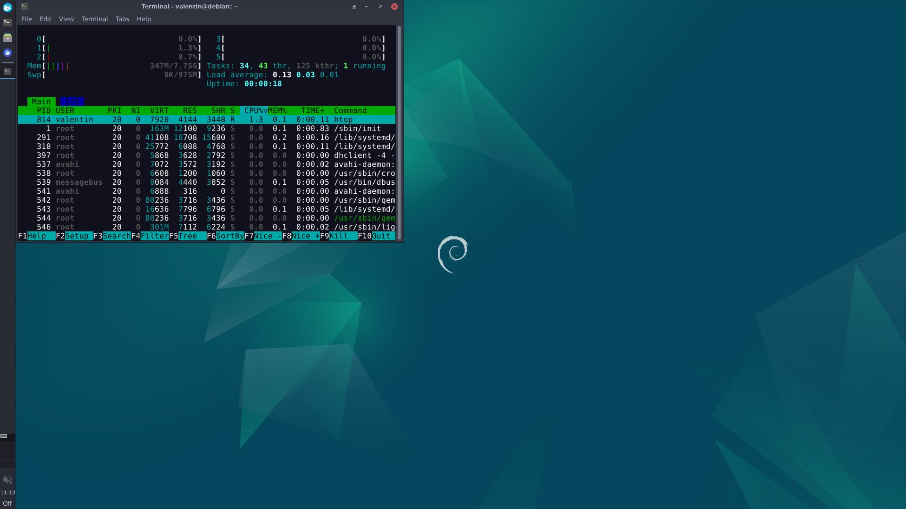

# debian-light

post install script to install a light xfce4 desktop environment with autologin and most necessary tools / theming

1. install debian wiht the net installer, deselecting all options in the tasksel menu
2. run `sudo apt-get install wget -y`
3. download the scripts with `wget https://github.com/vwueest/debian-light/raw/main/install.sh` and `wget https://github.com/vwueest/debian-light/raw/main/install-2.sh`
4. run `bash install.sh`, which will eventually reboot the system
5. after the reboot, run `bash install-2.sh`
6. adjust the launcher icons in the panel to your liking and set the terminal background color
7. to enable window snapping, open "Window Manager", go to the "Advanced" tab and uncheck the "With a dragged window".

Done! Enjoy your new light debian desktop environment with 350MB RAM usage on idle

Notes: the scripts do the following:
- `install.sh`
  - installs xfce4 desktop environment and necessary components
  - installs the arc-theme and papirus-icon-theme
  - installs a few useful programs
    - vim
    - htop
    - tmux
    - neofetch
    - falkon browser
    - arandr
  - enables autologin
  - sets screen resolution to 1080p at boot
- `install2.sh`
  - sets the papirus icon theme and arc theme
  - sets panel theme